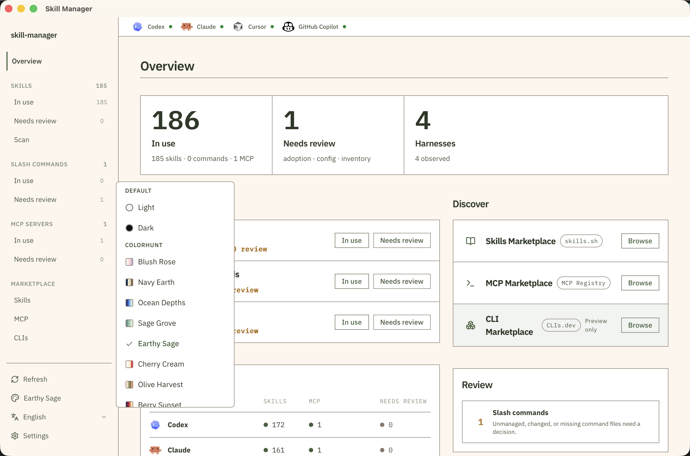
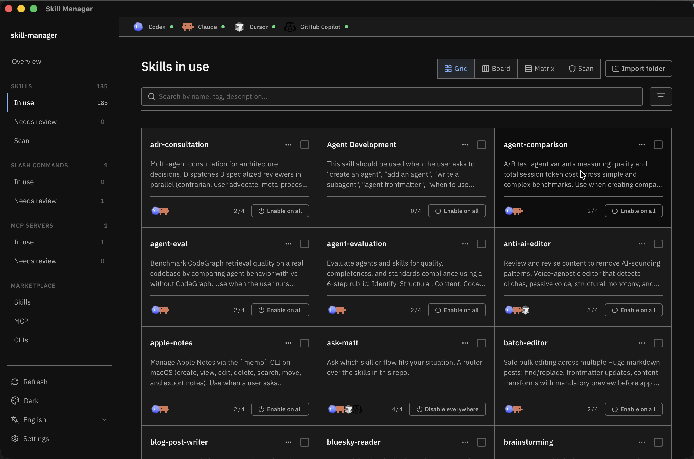
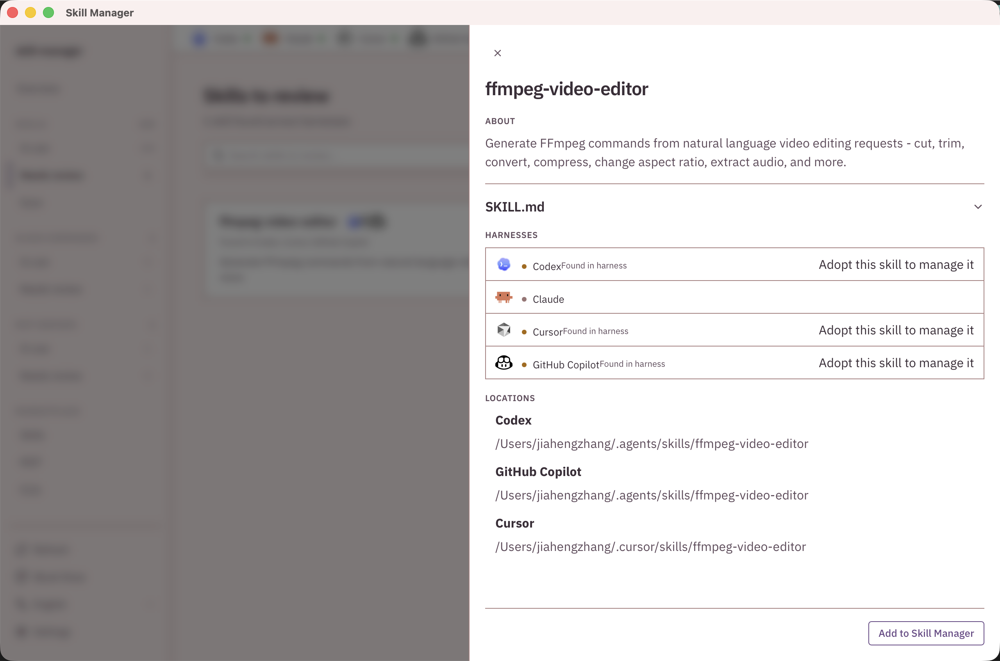
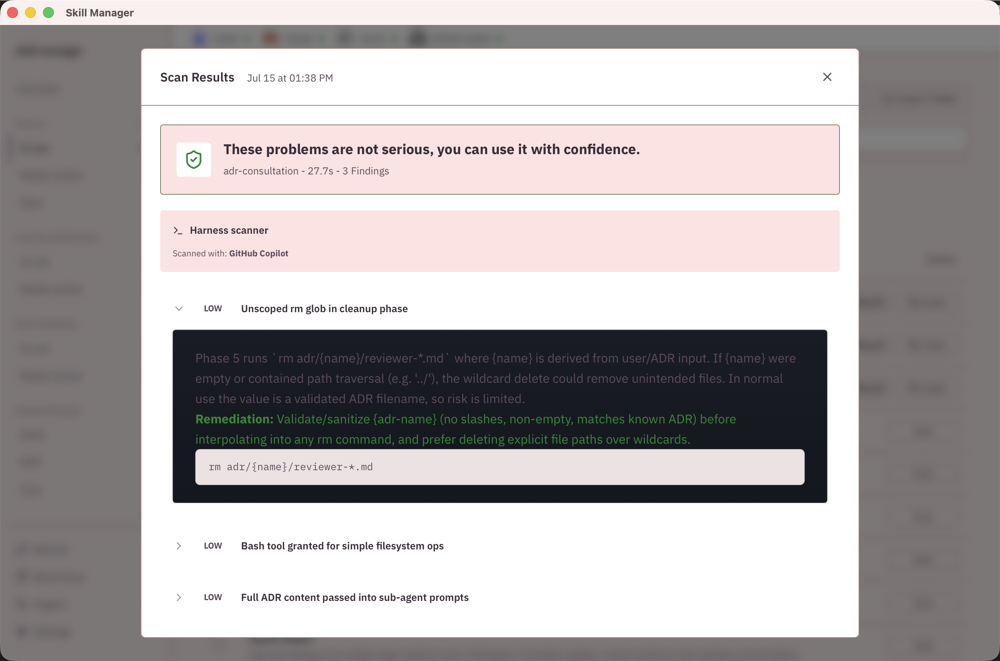
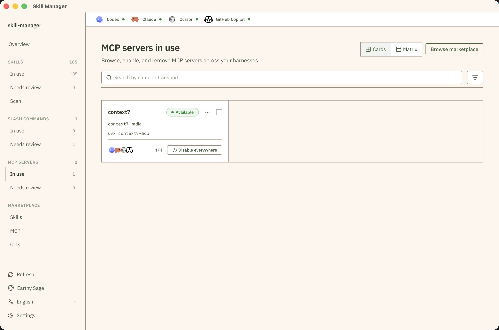
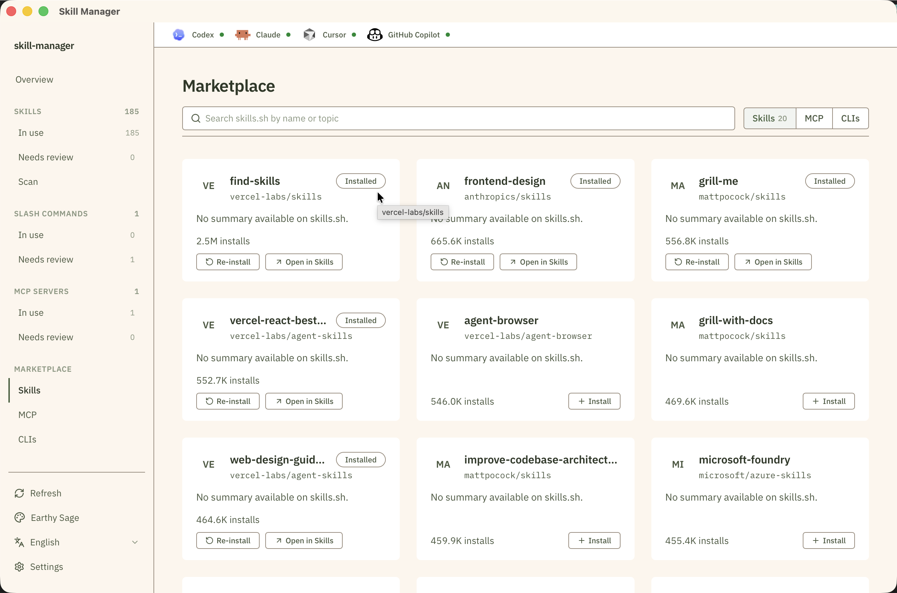
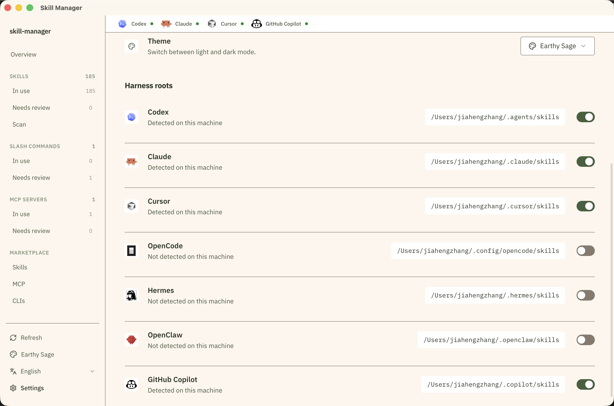

# skill-manager

[中文说明](README.zh-CN.md)

<p align="center">
  
</p>

<p align="center">
  <strong>A local-first control center for AI extensions.</strong><br />
  Use, review, scan, and discover Skills, MCP servers, slash commands, and CLI tools across agent harnesses.
</p>

<p align="center">
  <a href="LICENSE"></a>
  <a href="https://github.com/recklyss/skill-manager/releases/latest"></a>
  <a href="https://www.npmjs.com/package/@recklyss/skill-manager"></a>
  <a href="#install"></a>
  <a href="#install"></a>
  <a href="#local-first-safety"></a>
</p>

## Why it exists

AI extensions are scattered across harness-specific folders, MCP config files, slash command locations, and marketplace sources. Skill Manager gives those pieces one local control surface:

| Product idea | What it means |
|---|---|
| **In use** | Skill Manager controls the item and can enable or disable it across harnesses. |
| **Needs review** | Skill Manager found local state, config differences, or inventory issues that need a decision. |
| **Scan** | Run harness CLI security checks against Skills before trusting them. |
| **Discover** | Browse marketplaces and preview external tools. |

## What you can do

- See what is in use, what needs review, and where extensions are active.
- Adopt local Skills into one shared inventory, then enable or disable them per harness.
- Scan Skills with an enabled harness CLI and review findings before use.
- Install or adopt MCP server configs, resolve differences, and enable them where supported.
- Manage reusable slash commands once, then sync them to supported harnesses.
- Discover Skills, MCP servers, and preview-only CLI tools from marketplace sources.
- Switch between light and dark mode and pick from built-in Color Hunt themes.

## Product tour

### Overview and themes

Start with the whole extension portfolio: what is in use, what needs review, what can be discovered, and where extensions are active. Switch themes from the sidebar — light, dark, and Color Hunt palettes such as Earthy Sage, Ocean Depths, and Berry Sunset.

<p align="center">
  
</p>

### Skills in use

Browse adopted Skills in grid, board, or matrix views. Search by name, tag, or description, then enable or disable a Skill per harness or everywhere at once. Dark mode is available for long review sessions.

<p align="center">
  
</p>

### Adopt a Skill

When Skill Manager finds a Skill in a harness but it is not yet managed, open the detail drawer to read its description, see which harnesses have it, and inspect on-disk locations. Adopt it into the shared inventory with one action.

Typical flow:

1. Review a Skill found in a harness or install one from the marketplace.
2. Adopt it into the Skill Manager inventory.
3. Enable it only where it should be available.
4. Update, remove, or delete it from one place.

<p align="center">
  
</p>

### Skill scanning

Scan Skills with your enabled agent harness CLI before you rely on them. No separate LLM API configuration is required.

**Supported scan harnesses** (must be enabled in Settings and have the CLI on `PATH`):

| Harness | CLI binary | Invocation |
|---------|------------|------------|
| Claude | `claude` | `claude -p` (non-interactive) |
| Codex | `codex` | `codex exec` |
| GitHub Copilot | `copilot` | `copilot -p --allow-all` |
| Cursor | `cursor-agent` | `cursor-agent -p -f` |

Typical flow:

1. Enable at least one supported harness in Settings and install its CLI.
2. Switch Skills in use to the Scan view.
3. Pick the harness to scan with.
4. Run a scan for one Skill, selected Skills, or the full visible list.
5. Review severity, findings, snippets, and remediation guidance.

<p align="center">
  
</p>

Static heuristics always run locally. The selected harness CLI performs semantic analysis and must return strict JSON (`verdict`, `riskLevel`, `summary`, `findings`).

### MCP servers

Use MCP servers as one normalized config that can be written into each harness shape. Browse adopted servers, see transport details, and enable or disable them across harnesses from a single cards or matrix view.

Typical flow:

1. Review an MCP server found in a harness or install one from the marketplace.
2. Adopt it into the Skill Manager inventory.
3. Enable it where the server should be available.
4. Resolve config differences, disable harness bindings, or uninstall it from one place.

<p align="center">
  
</p>

### Slash commands

Use slash commands as one shared prompt library instead of rewriting the same command in each harness-specific format.

Typical flow:

1. Create a slash command with a name, description, and prompt.
2. Use `$ARGUMENTS` where runtime input should be inserted.
3. Sync it to supported harnesses.
4. Review existing harness command files and adopt them into the shared library when needed.

### Marketplace

Marketplace is the discovery surface:

- **Skills Marketplace**: browse and install Skills from skills.sh.
- **MCP Marketplace**: browse and install MCP servers from the MCP Registry.
- **CLI Marketplace**: preview external CLI tools from CLIs.dev. This is display-only; Skill Manager does not install or manage CLIs.

<p align="center">
  
</p>

### Settings

Enable or disable harness support, confirm where each harness stores Skills on disk, and choose your preferred theme. Skill Manager detects installed harnesses and shows their skill roots so you can verify paths before adopting extensions.

<p align="center">
  
</p>

## Install

### Homebrew (macOS recommended)

```bash
brew tap recklyss/tap
brew install skill-manager
skill-manager start
```

### npm (macOS ARM64/x64 and Linux x64/ARM64)

```bash
npm install -g @recklyss/skill-manager
skill-manager start
```

The npm wrapper downloads the native release artifact for the current platform and CPU architecture.
Native release artifacts are published on GitHub Releases for macOS ARM64/x64 and Linux x64/ARM64.

## Supported harnesses

<table align="center">
  <tr>
    <td align="center" valign="middle">
      <br />
      <strong>Codex CLI</strong><br />
      <a href="https://developers.openai.com/codex/cli">Docs</a>
    </td>
    <td align="center" valign="middle">
      <br />
      <strong>Claude Code</strong><br />
      <a href="https://code.claude.com/docs/en/overview">Docs</a>
    </td>
    <td align="center" valign="middle">
      <br />
      <strong>Cursor</strong><br />
      <a href="https://cursor.com/docs">Docs</a>
    </td>
    <td align="center" valign="middle">
      <br />
      <strong>OpenCode</strong><br />
      <a href="https://opencode.ai/docs">Docs</a>
    </td>
    <td align="center" valign="middle">
      <br />
      <strong>Hermes Agent</strong><br />
      <a href="https://hermes-agent.nousresearch.com/docs">Docs</a>
    </td>
    <td align="center" valign="middle">
      <br />
      <strong>OpenClaw</strong><br />
      <a href="https://docs.openclaw.ai/start/getting-started">Docs</a>
    </td>
    <td align="center" valign="middle">
      <br />
      <strong>GitHub Copilot</strong><br />
      <a href="https://docs.github.com/en/copilot/how-tos/copilot-cli">Docs</a>
    </td>
  </tr>
</table>

| Harness | Skills | MCP servers | Slash commands |
|---|---:|---:|---:|
| Codex CLI | Yes | Yes | Yes |
| Claude Code | Yes | Yes | Yes |
| Cursor | Yes | Yes | Yes |
| OpenCode | Yes | Yes | Yes |
| Hermes Agent | Yes | Yes | Not Yet |
| OpenClaw | Yes | Not Yet | Not Yet |
| GitHub Copilot | Yes | Yes | Not Yet |

## Local-first safety

Skill Manager is a local configuration-management tool. It runs on your machine and reads or writes local harness extension state.

Actions that can change local state include:

- adopting a local skill folder
- enabling or disabling a skill for a harness
- updating a source-backed skill
- removing or deleting a skill
- running a Skill scan, which sends bounded Skill context to the selected harness CLI for analysis
- installing an MCP server into a selected harness config
- adopting an existing MCP config
- enabling, disabling, resolving, or uninstalling an MCP server
- creating, updating, syncing, importing, or deleting a slash command
- changing harness support settings

App-owned files live under `~/Library/Application Support/skill-manager` on macOS and XDG base directories on Linux.

## How it works

### Skills

Before adoption, each harness points at its own local skill folder. After adoption, Skill Manager keeps one canonical package in its shared local store and exposes it to selected harnesses with local links. Disabling a harness removes that harness binding without deleting the package.

Skill Manager treats managed Skills as portable by default: once a Skill is adopted into the shared store, it can be enabled for any supported harness. `originHarness` is retained only as provenance.

Hermes Agent Skills use the categorized Hermes layout under `~/.hermes/skills/<category>/<skill>/SKILL.md`. Shared Skills enabled for Hermes are linked under the `skill-manager` category by default. Skill Manager only imports Hermes Skills that Hermes itself installed from external hub provenance (`.hub/lock.json` entries that are not official/builtin/optional). Hermes self-learned/local Skills, bundled Skills tracked by `.bundled_manifest`, and official optional Skills recorded in Hermes hub provenance are excluded from Skill Manager inventory and bulk actions; Skill Manager leaves those folders untouched so `hermes update` and Hermes-owned Skill sync keep their normal ownership.

### Skill scans

Skill scans build a bounded prompt context from `SKILL.md` and selected text files in the skill package (up to 64 KB). Static heuristics run locally. Semantic analysis invokes the harness CLI you pick in the Scan view (Claude, Codex, Copilot, or Cursor). The CLI must return strict JSON with `verdict`, `riskLevel`, `summary`, and `findings`. Scans time out after 120 seconds.

Legacy LLM scan configuration APIs remain for compatibility but are no longer required for the primary scan workflow.

Scan reports show whether the Skill is safe, the maximum severity, findings, locations, snippets, and remediation text. The frontend caches completed reports in browser local storage so recent results remain visible after navigation.

### MCP servers

MCP servers are stored as normalized Skill Manager records, then translated into the config shape each harness expects:

- Codex uses TOML under `mcp_servers`.
- Claude Code and Cursor use `mcpServers` JSON entries.
- OpenCode uses typed local/remote MCP entries.
- Hermes Agent uses YAML under `mcp_servers` in `~/.hermes/config.yaml` (or `$HERMES_HOME/config.yaml`).
- OpenClaw MCP writes are not yet supported.

When Skill Manager finds different configs for the same MCP server, it asks you to resolve the source of truth first.

### Slash commands

Slash commands are stored as TOML records under Skill Manager app storage, then rendered into each supported harness format:

- OpenCode writes Markdown command files under `~/.config/opencode/commands` and invokes them with `/`.
- Claude Code writes Markdown command files under `~/.claude/commands` and invokes them with `/`.
- Cursor writes plain text command files under `~/.cursor/commands` and invokes them with `/`.
- Codex writes prompt files under `~/.codex/prompts` and invokes them with `/prompts:`.
- Hermes Agent slash command writes are not yet supported; reusable Hermes workflows are managed through Skills.
- OpenClaw slash command writes are not yet supported.

Skill Manager tracks target ownership with sync state and content hashes. It will not overwrite an untracked command file automatically, and it reports managed files as changed or missing when the target no longer matches the last synced hash. Review actions let you adopt unmanaged commands, restore managed content, adopt a changed harness command as the new source, or remove a broken binding while leaving the harness file untouched.

### CLIs

CLI marketplace entries are preview-only.

## Configuration

On macOS, app-owned files live under `~/Library/Application Support/skill-manager`. On Linux, app-owned files use XDG base directories.

Useful macOS paths:

- shared skills store: `~/Library/Application Support/skill-manager/shared`
- MCP manifest: `~/Library/Application Support/skill-manager/mcp/manifest.json`
- slash command library: `~/Library/Application Support/skill-manager/slash-commands/commands`
- slash command sync state: `~/Library/Application Support/skill-manager/slash-commands/sync-state.json`
- marketplace cache: `~/Library/Application Support/skill-manager/marketplace`
- app database and LLM scan configs: `~/Library/Application Support/skill-manager/skill-manager.db`
- app settings: `~/Library/Application Support/skill-manager/settings.json`

Useful Linux paths:

- shared skills store: `${XDG_DATA_HOME:-~/.local/share}/skill-manager/shared`
- MCP manifest: `${XDG_DATA_HOME:-~/.local/share}/skill-manager/mcp/manifest.json`
- slash command library: `${XDG_DATA_HOME:-~/.local/share}/skill-manager/slash-commands/commands`
- slash command sync state: `${XDG_DATA_HOME:-~/.local/share}/skill-manager/slash-commands/sync-state.json`
- marketplace cache: `${XDG_DATA_HOME:-~/.local/share}/skill-manager/marketplace`
- app database and LLM scan configs: `${XDG_DATA_HOME:-~/.local/share}/skill-manager/skill-manager.db`
- app settings: `${XDG_CONFIG_HOME:-~/.config}/skill-manager/settings.json`

Most users do not need to change these locations. If you manage skills in a custom environment, you can override individual skill roots with environment variables.

| Harness | Env var | Default Skill Manager skill root |
|---|---|---|
| Codex | `SKILL_MANAGER_CODEX_ROOT` | `~/.agents/skills` |
| Claude | `SKILL_MANAGER_CLAUDE_ROOT` | `~/.claude/skills` |
| Cursor | `SKILL_MANAGER_CURSOR_ROOT` | `~/.cursor/skills` |
| OpenCode | `SKILL_MANAGER_OPENCODE_ROOT` | `~/.config/opencode/skills` |
| Hermes Agent | `SKILL_MANAGER_HERMES_ROOT` | `${HERMES_HOME:-~/.hermes}/skills` |
| OpenClaw | `n/a` | `~/.openclaw/skills` |
| GitHub Copilot | `SKILL_MANAGER_COPILOT_ROOT` | `~/.copilot/skills` |

MCP config locations are harness-owned. Skill Manager writes only to verified config paths and skips unsupported harness writes. Hermes Agent config discovery honors `SKILL_MANAGER_HERMES_HOME` first, then `HERMES_HOME`, then `~/.hermes`.

## From source

### Tauri desktop app (recommended)

```bash
# Requirements: Rust 1.85+, Node.js 24+ (see `.nvmrc`)
npm install
npm run tauri:dev
```

The app opens as a native desktop window — no browser, no manual server start.

Build a native installer:

```bash
npm run tauri:build
```

### Validation

```bash
npm run typecheck
npm test
npm run test:rust                # Rust integration tests
npm run build
cd src-tauri && cargo check      # Rust compile check
```

## Troubleshooting

- If Marketplace requests fail with `Marketplace is temporarily unavailable`, verify your network connection and try again.
- On macOS, if `npm install -g @recklyss/skill-manager` reports that Homebrew already owns `skill-manager`, uninstall the Homebrew formula first. The inverse also applies: uninstall the npm package before switching back to Homebrew.
- If an MCP harness is shown as unavailable, Skill Manager has detected that the local client is missing or does not support the required config surface.

## More to come

### Extension families

- [ ] Hook support
- [x] Slash command support
- [ ] Plugin support

### Harness expansion

- [x] GitHub Copilot
- [ ] Gemini CLI
- [ ] Cline
- [ ] Windsurf
- [ ] Qwen Code
- [ ] Kimi Code
- [ ] Qoder

## Community

- See [CONTRIBUTING.md](CONTRIBUTING.md) for contribution guidelines.
- See [SECURITY.md](SECURITY.md) to report vulnerabilities privately.
